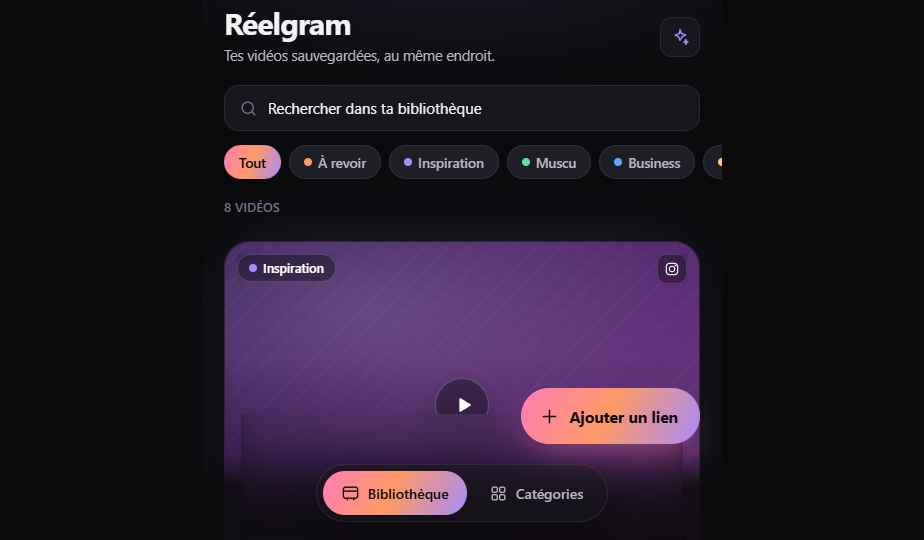

<div align="center">


# Réelgram

### Ton vault privé de Reels. Verrouillé, rien que pour toi.

**Les vidéos Instagram que tu veux *vraiment* revoir — sauvegardées, classées, et à toi pour toujours.**
Pas un réseau social. Pas un feed. Pas d'algorithme. Juste *ta* bibliothèque, premium et privée.

<br/>


</div>

---

> **Tu connais ce Reel parfait** — la routine, l'astuce business, l'exo, l'idée — que tu « gardes » dans Instagram… puis que tu ne **retrouves jamais**. Les collections Instagram sont un cimetière. Réelgram, c'est l'inverse : un **coffre-fort personnel**, beau, rapide, où chaque vidéo sauvegardée est **vraiment à toi**, organisée et prête à revoir en deux secondes.

## ✨ Pourquoi tu vas l'adorer

- 📲 **Sauvegarde en 1 geste depuis iOS** — partage un Reel → il atterrit dans ton vault. Un Raccourci iOS natif fait tout le travail.
- 🗄️ **Une bibliothèque qui donne envie** — grandes cartes immersives, miniatures réelles, recherche instantanée, filtres par catégorie.
- 🎬 **Un lecteur cinématique** — plein écran 9:16, glow ambiant tiré de la vidéo, contrôles minimalistes. Premium, pas bricolé.
- 🏷️ **Range comme tu penses** — À revoir, Inspiration, Muscu, Business, Humour, Idées… crée, renomme, recolore tes catégories.
- 🔒 **Déverrouillage Face ID** — ton vault s'ouvre d'un regard. Rien ne fuit, rien n'est public.
- 📴 **Installable & offline-ready** — vraie PWA : ajoute-la à l'écran d'accueil, elle se comporte comme une app iPhone native.
- 🏠 **Tu héberges, tu possèdes** — tes vidéos vivent sur **ton** serveur (volume local), pas chez un tiers.

## 🎥 Comment ça marche

```
   📱 Partage un Reel        ⚙️  Réelgram récupère        🍿 Tu regardes
      depuis Instagram   →      la vidéo + miniature   →     quand tu veux
                                  (yt-dlp, en fond)         depuis ton vault
```

1. **Partage** le lien Instagram via la feuille de partage iOS (ou colle-le dans l'app).
2. **Réelgram sauvegarde** : analyse → récupération → miniature → prêt. Progression élégante, zéro attente bloquante.
3. **Tu regardes**, classes, renommes ou supprimes — c'est ta bibliothèque.

## 🎨 Direction artistique

Dark mode profond presque noir, accents en dégradé **rose → orange → violet**, glassmorphism subtil, coins très arrondis, micro-transitions soignées. Inspiré de l'élégance de Linear, Raycast et Things — l'effet wow vient du **polish**, pas de la surcharge.

<div align="center">

</div>

## 🧱 Sous le capot

| Couche | Techno |
|--------|--------|
| **App** | PWA Vite + React + TypeScript, installable, Face ID (WebAuthn) |
| **API** | FastAPI + **yt-dlp** + **gallery-dl** + ffmpeg — récupération vidéo & posts image, miniatures, streaming HTTP range derrière URLs signées |
| **Données** | Supabase Cloud — Auth email/mot de passe + Postgres, isolation **multi-compte par RLS** |
| **Vidéos** | Stockées sur un **volume local** (pas dans le cloud) |
| **Déploiement** | Docker Compose, **Coolify-ready** depuis GitHub — `web` (nginx + PWA, reverse-proxy `/api`) + `api` interne + volume persistant |

Même origine (pas de CORS), config injectée au runtime (une seule image pour tous les environnements), `api` jamais exposé publiquement.

> **Posts image & carrousels** — les photos et carrousels Instagram (`/p/`) sont extraits via **gallery-dl**, qui réutilise le **même fichier de cookies** (`IG_COOKIES_FILE`) que yt-dlp. Aucune configuration supplémentaire n'est nécessaire ; voir [`docs/DEPLOY.md`](docs/DEPLOY.md#cookies-instagram-optionnel) pour la mise en place des cookies.

## 🚀 Mise en ligne en quelques minutes

1. Crée un projet **Supabase** → applique `supabase/migrations/0001_init.sql`.
2. Renseigne les variables (`.env.example` → secrets dans l'UI Coolify), dont `MEDIA_TOKEN_SECRET` (`openssl rand -hex 32`).
3. Sur **Coolify** : ressource *Docker Compose* pointée sur ce repo → déploie → mappe ton domaine sur `web`.

👉 **Guide complet : [`docs/DEPLOY.md`](docs/DEPLOY.md)**

## 📱 Raccourci iOS

Envoie n'importe quel Reel vers ton vault depuis la feuille de partage Instagram, en un tap.
👉 **Recette pas-à-pas : [`docs/ios-shortcut.md`](docs/ios-shortcut.md)**

## 🔒 Privé par conception

Aucun compte public, aucun feed, aucun tracking. Chaque compte est **isolé par Row-Level Security** : tu ne vois que tes vidéos. Les médias sont servis derrière des **URLs signées** à durée de vie courte. Ton vault, tes règles.

---

<div align="center">

**Réelgram** — *« ok, c'est exactement ce qu'il me fallait. »*

</div>
